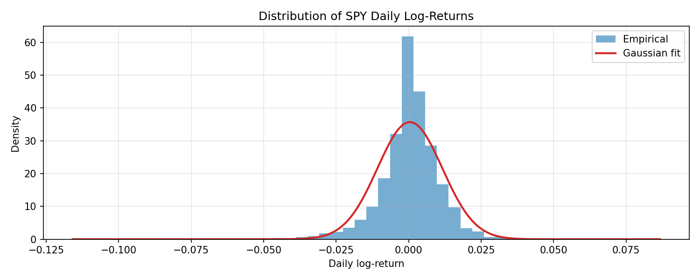
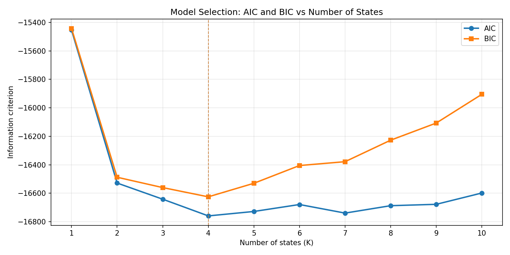
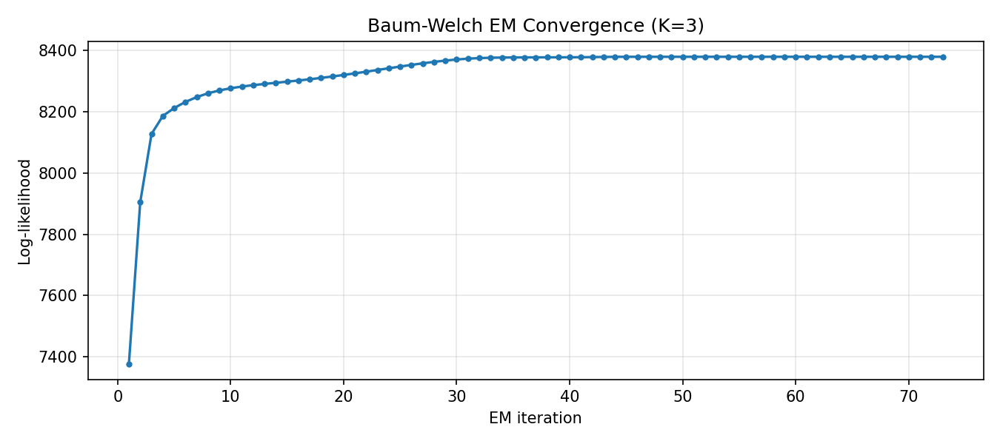
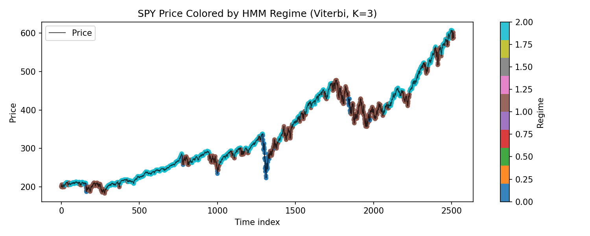
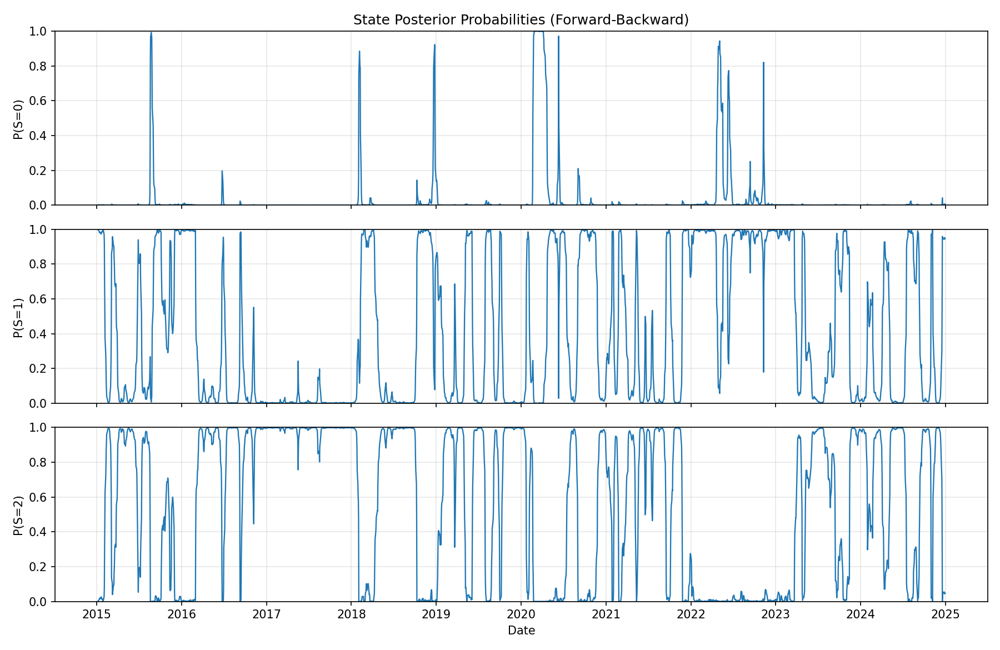
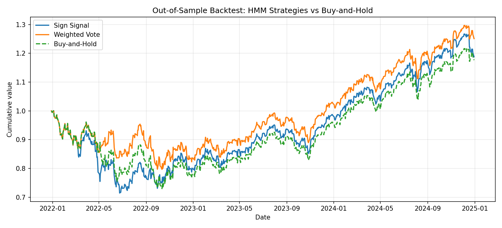

# HMM Momentum Trading

Reproduction of Christensen, Turner & Godsill (2020), *"Hidden Markov Models Applied To Intraday Momentum Trading With Side Information"* (arXiv:2006.08307), for the course Advanced Signal Processing: Tools and Applications (ASPTA) at UPC Barcelona.

## Overview

A 3-state Gaussian Hidden Markov Model detects latent momentum regimes (downtrend / neutral / uptrend) from noisy log-returns and generates trading signals via Bayesian filtering.

```
Layer 4: Experiments & Extensions     <- what you present
Layer 3: Trading Strategy & Backtest  <- applies the model to financial data
Layer 2: HMM Engine                   <- forward, backward, Baum-Welch, Viterbi
Layer 1: Data & Utilities             <- data loading, feature computation, plotting
```

## Setup

```bash
python -m venv .venv
source .venv/bin/activate   # Linux/Mac
# .venv\Scripts\activate    # Windows
pip install -r requirements.txt
```

## Running Tests

```bash
pytest -v   # 82 tests across all layers
```

## Project Structure

```
src/
  data/
    loader.py              # yfinance wrapper + extract_close_series helper
    features.py            # log-returns, EWMA volatility, normalization
  hmm/
    forward.py             # forward algorithm (Paper S3.2, Alg 1 lines 6-9)
    backward.py            # backward algorithm (Paper S3.2, Alg 1 lines 11-14)
    forward_backward.py    # E-step: gamma and xi posteriors
    baum_welch.py          # EM training with random restarts (Paper S3.2, Alg 1)
    viterbi.py             # MAP state sequence decoding
    model_selection.py     # AIC / BIC for choosing K
    inference.py           # online predict-update loop (Paper S6, Alg 4)
    utils.py               # shared helpers: sort_states, train_best_model
  strategy/
    signals.py             # convert predictions to trading signals
    backtest.py            # simulate P&L with transaction costs
  utils/
    metrics.py             # Sharpe ratio, max drawdown, annualized return
    plotting.py            # regime-colored charts, cumulative returns

experiments/
  01_data_exploration.py   # load data, plot returns, basic stats
  02_model_selection.py    # AIC/BIC vs K (reproduce paper Figure 2)
  03_baum_welch_training.py # train HMM, show convergence
  04_regime_detection.py   # Viterbi decoding overlaid on price
  05_backtest_comparison.py # HMM strategy vs buy-and-hold
  06_em_vs_mcmc.py         # Extension A: EM vs MCMC comparison
  07_multi_asset.py        # Extension B: multi-asset analysis
  08_k3_vs_k4.py           # Tier 1: quantitative answer to K=3 vs K=4

tests/                     # pytest suite (82 tests)
docs/                      # paper PDFs, architecture docs, math mappings
figures/                   # output directory for experiment plots
reports/                   # output directory for experiment text reports
```

## Implementation Principles

- **Pure functions, not classes** -- each HMM algorithm is one function in one file
- **Log-space everywhere** -- all probability computations use log-probabilities with `logsumexp`
- **NumPy only for core math** -- Gaussian PDF implemented directly, no `scipy.stats`
- **Validated at every layer** -- each function tested against synthetic data and `hmmlearn`

## Key Algorithms

| Algorithm | File | Paper Reference |
|-----------|------|----------------|
| Forward | `src/hmm/forward.py` | S3.2, Algorithm 1 lines 6-9 |
| Backward | `src/hmm/backward.py` | S3.2, Algorithm 1 lines 11-14 |
| Forward-Backward | `src/hmm/forward_backward.py` | S3.2, Algorithm 1 line 16 |
| Baum-Welch (EM) | `src/hmm/baum_welch.py` | S3.2, Algorithm 1 lines 17-21 |
| Viterbi | `src/hmm/viterbi.py` | S2.2, Problem 2 |
| Online Inference | `src/hmm/inference.py` | S6, Algorithm 4 |

## Running Experiments

Each experiment is standalone and saves figures to `figures/` and text reports to `reports/`:

```bash
python experiments/01_data_exploration.py
python experiments/02_model_selection.py
python experiments/03_baum_welch_training.py
python experiments/04_regime_detection.py
python experiments/05_backtest_comparison.py
python experiments/08_k3_vs_k4.py
```

## Results (SPY, 2015-2024)

### 1. Why not a single Gaussian?

The distribution of daily log-returns shows heavy tails and negative skewness (skew = -0.80, excess kurtosis = 13.42). A single Gaussian (red curve) badly underestimates the probability of extreme moves, motivating a mixture model.



| Metric | Value |
|--------|-------|
| Observations | 2514 daily log-returns |
| Annualized return | 11.12% |
| Annualized volatility | 17.76% |
| Skewness | -0.80 |
| Excess kurtosis | 13.42 |

### 2. How many states?

We fit HMMs with K=1 to K=10 and select the model that minimizes AIC / BIC. Both criteria agree on **K=4**, with K=3 as a close runner-up (ΔBIC = 65). We use K=3 throughout the project for interpretability: one bearish, one neutral, and one bullish regime.



### 3. EM convergence

The Baum-Welch algorithm converges in 73 iterations with a log-likelihood improvement of +1003 nats. 9 out of 10 random restarts converge to the same optimum, indicating a well-defined global maximum.



### 4. Learned regimes

The trained model recovers three economically meaningful regimes:

| State | Label | Daily μ | Ann. Return | Ann. Vol | Stationary Prob | Avg Duration |
|-------|-------|---------|-------------|----------|-----------------|--------------|
| 0 | Bearish | -0.058% | -145% | 56.5% | 3.6% | 9 days |
| 1 | Neutral | ~0.00% | ~0% | 19.6% | 40.4% | 23 days |
| 2 | Bullish | +0.11% | +28% | 8.5% | 56.0% | 38 days |

The bearish state has 7x the volatility of the bullish state, consistent with the leverage effect. The market spends most time in the calm bullish regime (56%).

Viterbi decoding assigns each trading day to one regime. The coloring below shows bearish episodes (blue, state 0) concentrated around COVID-19 (2020) and the 2022 drawdown, while long stretches of cyan (state 2, bullish) dominate the uptrend periods:



The forward-backward posteriors show the probability of each state over time. State 0 (bearish) spikes only during sharp sell-offs, state 1 (neutral) activates during choppy sideways markets, and state 2 (bullish) dominates during sustained rallies:



### 5. Out-of-sample backtest (2022-2024)

The model is trained on 70% of the data (2015-2021) and tested on the remaining 30% (2022-2024). Two signal types are compared against buy-and-hold, with 5 bps transaction costs:

| Strategy | Sharpe | Ann. Return | Max Drawdown | Turnover |
|----------|--------|-------------|--------------|----------|
| **Weighted vote** | **0.54** | **7.77%** | **20.33%** | 0.043 |
| Sign signal | 0.42 | 5.92% | 28.57% | 0.080 |
| Buy-and-hold | 0.40 | 5.57% | 27.06% | 0.000 |

The **weighted vote** signal outperforms buy-and-hold with a 35% higher Sharpe ratio (0.54 vs 0.40) and 25% lower maximum drawdown (20.3% vs 27.1%). It achieves this by scaling down exposure during high-volatility regimes rather than making binary long/short bets.



## References

- Christensen, H.L., Turner, R.E. & Godsill, S.J. (2020). *Hidden Markov Models Applied To Intraday Momentum Trading With Side Information*. arXiv:2006.08307.
- Rabiner, L.R. (1989). *A Tutorial on Hidden Markov Models and Selected Applications in Speech Recognition*. Proceedings of the IEEE, 77(2), 257-286.
