# HMM & RBPF Momentum Trading

Reproduction and comparison of two regime-switching approaches for the course Advanced Signal Processing: Tools and Applications (ASPTA) at UPC Barcelona:

1. **HMM (2020 paper):** Christensen, Turner & Godsill, *"Hidden Markov Models Applied To Intraday Momentum Trading With Side Information"* (arXiv:2006.08307)
2. **RBPF (2012 paper):** Christensen, Godsill & Turner, *"Bayesian Methods for Jump-Diffusion Langevin Models"* — Rao-Blackwellized particle filtering for continuous-time trend estimation

## Overview

A 3-state Gaussian Hidden Markov Model detects latent momentum regimes (downtrend / neutral / uptrend) from noisy log-returns and generates trading signals via Bayesian filtering. As an extension, a Rao-Blackwellized Particle Filter (RBPF) estimates trends from a continuous-time Langevin jump-diffusion model and is compared head-to-head against the HMM.

```
Layer 5: Langevin / RBPF Engine       <- Kalman filter, particle filter, RBPF
Layer 4: Experiments & Extensions     <- what you present
Layer 3: Trading Strategy & Backtest  <- applies the model to financial data
Layer 2: HMM Engine                   <- forward, backward, Baum-Welch, Viterbi
Layer 1: Data & Utilities             <- data loading, feature computation, plotting
```

## Setup

```bash
python -m venv .venv
source .venv/bin/activate   # Linux/Mac
# .venv\Scripts\activate    # Windows
pip install -r requirements.txt
```

## Running Tests

```bash
pytest -v   # 247 tests across all layers
```

## Project Structure

```
src/
  data/
    loader.py              # yfinance wrapper + extract_close_series helper
    features.py            # log-returns, EWMA volatility, normalization
  hmm/
    forward.py             # forward algorithm (Paper S3.2, Alg 1 lines 6-9)
    backward.py            # backward algorithm (Paper S3.2, Alg 1 lines 11-14)
    forward_backward.py    # E-step: gamma and xi posteriors
    baum_welch.py          # EM training with random restarts (Paper S3.2, Alg 1)
    viterbi.py             # MAP state sequence decoding
    model_selection.py     # AIC / BIC for choosing K
    inference.py           # online predict-update loop (Paper S6, Alg 4)
    utils.py               # shared helpers: sort_states, train_best_model
  langevin/
    model.py               # Langevin jump-diffusion SDE (2012 Paper §II)
    kalman.py              # Kalman filter predict/update (2012 Paper §III-A)
    particle.py            # standard bootstrap particle filter (2012 Paper §III-B)
    rbpf.py                # Rao-Blackwellized particle filter (2012 Paper §III-C)
    utils.py               # parameter estimation, trading signal transfer function
  strategy/
    signals.py             # convert predictions to trading signals
    backtest.py            # simulate P&L with transaction costs
  utils/
    metrics.py             # Sharpe ratio, max drawdown, annualized return
    plotting.py            # regime-colored charts, cumulative returns

experiments/
  01_data_exploration.py   # load data, plot returns, basic stats
  02_model_selection.py    # AIC/BIC vs K (reproduce paper Figure 2)
  03_baum_welch_training.py # train HMM, show convergence
  04_regime_detection.py   # Viterbi decoding overlaid on price
  05_backtest_comparison.py # HMM strategy vs buy-and-hold
  06_em_vs_mcmc.py         # Extension A: EM vs MCMC comparison
  07_multi_asset.py        # Extension B: multi-asset analysis
  08_k3_vs_k4.py           # Tier 1: quantitative answer to K=3 vs K=4
  09_rolling_backtest.py   # Tier 1: expanding-window robustness backtest
  10_signal_refinement.py  # Tier 3: no-trade zone + EMA smoothing grid search
  11_robustness_test.py    # Tier 3: robustness across tickers and periods
  12_kalman_filter_intro.py # Kalman filter on synthetic Langevin data
  13_langevin_model.py     # RBPF jump detection on synthetic data (Paper Fig 3)
  14_particle_filter_baseline.py # Standard PF baseline on SPY
  15_rbpf_trading.py       # RBPF trading: jumps ON vs OFF
  16_hmm_vs_rbpf.py        # Head-to-head: HMM vs RBPF vs PF vs B&H

tests/                     # pytest suite (247 tests)
docs/                      # paper PDFs, architecture docs, math mappings
figures/                   # output directory for experiment plots
reports/                   # output directory for experiment text reports
```

## Implementation Principles

- **Pure functions, not classes** -- each HMM algorithm is one function in one file
- **Log-space everywhere** -- all probability computations use log-probabilities with `logsumexp`
- **NumPy only for core math** -- Gaussian PDF implemented directly, no `scipy.stats`
- **Validated at every layer** -- each function tested against synthetic data and `hmmlearn`

## Key Algorithms

| Algorithm | File | Paper Reference |
|-----------|------|----------------|
| Forward | `src/hmm/forward.py` | S3.2, Algorithm 1 lines 6-9 |
| Backward | `src/hmm/backward.py` | S3.2, Algorithm 1 lines 11-14 |
| Forward-Backward | `src/hmm/forward_backward.py` | S3.2, Algorithm 1 line 16 |
| Baum-Welch (EM) | `src/hmm/baum_welch.py` | S3.2, Algorithm 1 lines 17-21 |
| Viterbi | `src/hmm/viterbi.py` | S2.2, Problem 2 |
| Online Inference | `src/hmm/inference.py` | S6, Algorithm 4 |
| Langevin SDE | `src/langevin/model.py` | 2012 Paper §II, Eq 1-5 |
| Kalman Filter | `src/langevin/kalman.py` | 2012 Paper §III-A, Eq 22-30 |
| Standard PF | `src/langevin/particle.py` | 2012 Paper §III-B, Eq 38-43 |
| RBPF | `src/langevin/rbpf.py` | 2012 Paper §III-C, Eq 44-48 |
| Trading Signal | `src/langevin/utils.py` | 2012 Paper §IV-D, Eq 46 |

## Running Experiments

Each experiment is standalone and saves figures to `figures/` and text reports to `reports/`:

```bash
python experiments/01_data_exploration.py
python experiments/02_model_selection.py
python experiments/03_baum_welch_training.py
python experiments/04_regime_detection.py
python experiments/05_backtest_comparison.py
python experiments/06_em_vs_mcmc.py
python experiments/07_multi_asset.py
python experiments/08_k3_vs_k4.py
python experiments/09_rolling_backtest.py
python experiments/10_signal_refinement.py
python experiments/11_robustness_test.py

# Langevin / RBPF experiments
python experiments/12_kalman_filter_intro.py
python experiments/13_langevin_model.py
python experiments/14_particle_filter_baseline.py
python experiments/15_rbpf_trading.py
python experiments/16_hmm_vs_rbpf.py
```

## Results (SPY, 2015-2024)

### 1. Why not a single Gaussian?

The distribution of daily log-returns shows heavy tails and negative skewness (skew = -0.80, excess kurtosis = 13.42). A single Gaussian (red curve) badly underestimates the probability of extreme moves, motivating a mixture model.


| Metric | Value |
|--------|-------|
| Observations | 2514 daily log-returns |
| Annualized return | 11.12% |
| Annualized volatility | 17.76% |
| Skewness | -0.80 |
| Excess kurtosis | 13.42 |

### 2. How many states?

We fit HMMs with K=1 to K=10 and select the model that minimizes AIC / BIC. Both criteria agree on **K=4**, with K=3 as a close runner-up (ΔBIC = 65). We use K=3 throughout the project for interpretability: one bearish, one neutral, and one bullish regime.


### 3. EM convergence

The Baum-Welch algorithm converges in 73 iterations with a log-likelihood improvement of +1003 nats. 9 out of 10 random restarts converge to the same optimum, indicating a well-defined global maximum.


### 4. Learned regimes

The trained model recovers three economically meaningful regimes:

| State | Label | Daily μ | Ann. Return* | Ann. Vol | Stationary Prob | Avg Duration |
|-------|-------|---------|--------------|----------|-----------------|--------------|
| 0 | Bearish | -0.058% | -77% | 56.5% | 3.6% | 9 days |
| 1 | Neutral | ~0.00% | ~0% | 19.6% | 40.4% | 23 days |
| 2 | Bullish | +0.11% | +32% | 8.5% | 56.0% | 38 days |

*Annualized return uses geometric compounding: (1 + μ)^252 − 1. The bearish regime lasts ~9 days on average; the annualized figure is a hypothetical extrapolation.*

The bearish state has 7x the volatility of the bullish state, consistent with the leverage effect. The market spends most time in the calm bullish regime (56%).

Viterbi decoding assigns each trading day to one regime. The coloring below shows bearish episodes (blue, state 0) concentrated around COVID-19 (2020) and the 2022 drawdown, while long stretches of cyan (state 2, bullish) dominate the uptrend periods:


The forward-backward posteriors show the probability of each state over time. State 0 (bearish) spikes only during sharp sell-offs, state 1 (neutral) activates during choppy sideways markets, and state 2 (bullish) dominates during sustained rallies:


### 5. Out-of-sample backtest (2022-2024)

The model is trained on 70% of the data (2015-2021) and tested on the remaining 30% (2022-2024). Two signal types are compared against buy-and-hold, with 5 bps transaction costs:

| Strategy | Sharpe | Ann. Return | Max Drawdown | Turnover |
|----------|--------|-------------|--------------|----------|
| **Weighted vote** | **0.54** | **7.77%** | **20.33%** | 0.043 |
| Sign signal | 0.42 | 5.92% | 28.57% | 0.080 |
| Buy-and-hold | 0.40 | 5.57% | 27.06% | 0.000 |

The **weighted vote** signal outperforms buy-and-hold with a 35% higher Sharpe ratio (0.54 vs 0.40) and 25% lower maximum drawdown (20.3% vs 27.1%). It achieves this by scaling down exposure during high-volatility regimes rather than making binary long/short bets.


### 6. EM vs MCMC (Extension A)

We compare maximum-likelihood EM (Baum-Welch) against a Bayesian Gibbs sampler (150 samples, 150 burn-in, thinning by 2). Both methods recover similar emission parameters, and the Gibbs sampler provides posterior uncertainty estimates for each parameter.

| Strategy | Sharpe | Ann. Return | Max Drawdown | Turnover |
|----------|--------|-------------|--------------|----------|
| **EM weighted vote** | **0.54** | **7.77%** | **20.33%** | 0.043 |
| MCMC weighted vote | 0.52 | 7.44% | 20.93% | 0.041 |
| Buy-and-hold | 0.40 | 5.57% | 27.06% | 0.000 |

The EM and MCMC strategies perform nearly identically out-of-sample, with EM having a slight edge in Sharpe (0.54 vs 0.52). The MCMC posterior standard deviations reveal that the bearish state mean has the highest uncertainty (std = 0.004), which is expected given its rarity (3.6% of observations). The key takeaway is that EM point estimates are sufficient for this dataset — the Bayesian approach confirms EM's robustness rather than improving upon it.

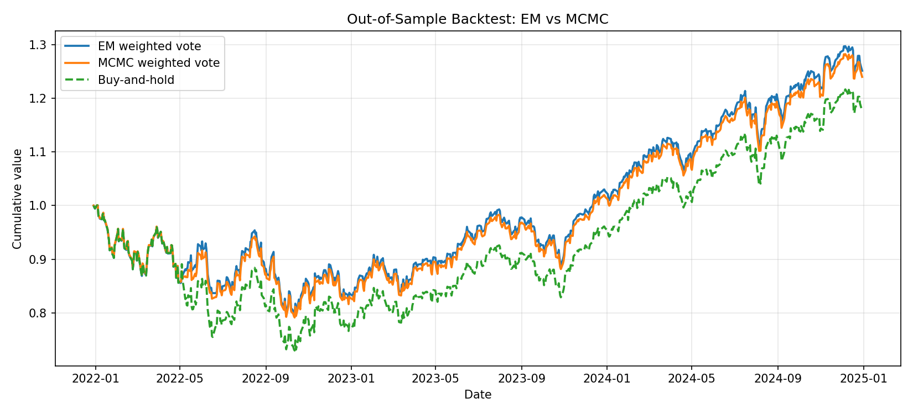
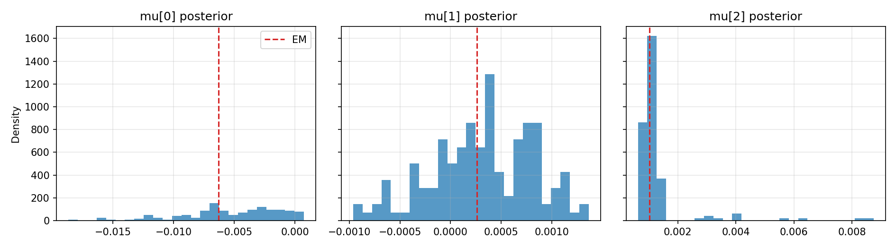

### 7. Multi-asset regime analysis (Extension B)

We train independent 3-state HMMs on four assets (SPY, QQQ, IWM, TLT) and examine cross-asset regime dynamics.

| Ticker | Sharpe | Ann. Return | Max Drawdown | Turnover |
|--------|--------|-------------|--------------|----------|
| SPY | 0.54 | 7.77% | 20.33% | 0.043 |
| **QQQ** | **0.78** | **13.04%** | 23.29% | 0.142 |
| IWM | 0.19 | 1.73% | 18.07% | 0.202 |
| TLT | -0.96 | -17.08% | 46.00% | 0.000 |

The bearish posterior correlation matrix reveals a flight-to-safety structure: equity bearish posteriors are positively correlated (SPY-QQQ: +0.50, SPY-IWM: +0.46, QQQ-IWM: +0.56), while TLT's bearish posterior is negatively correlated with all three equities (mean = -0.24). This confirms the model captures economically meaningful cross-asset dynamics.

An equal-weight HMM portfolio (Sharpe 0.18) outperforms equal-weight buy-and-hold (Sharpe -0.04), with max drawdown reduced from 31% to 20%.

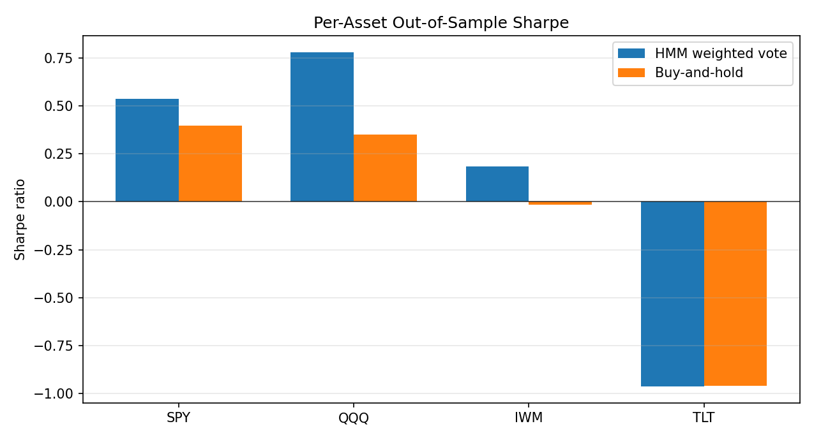
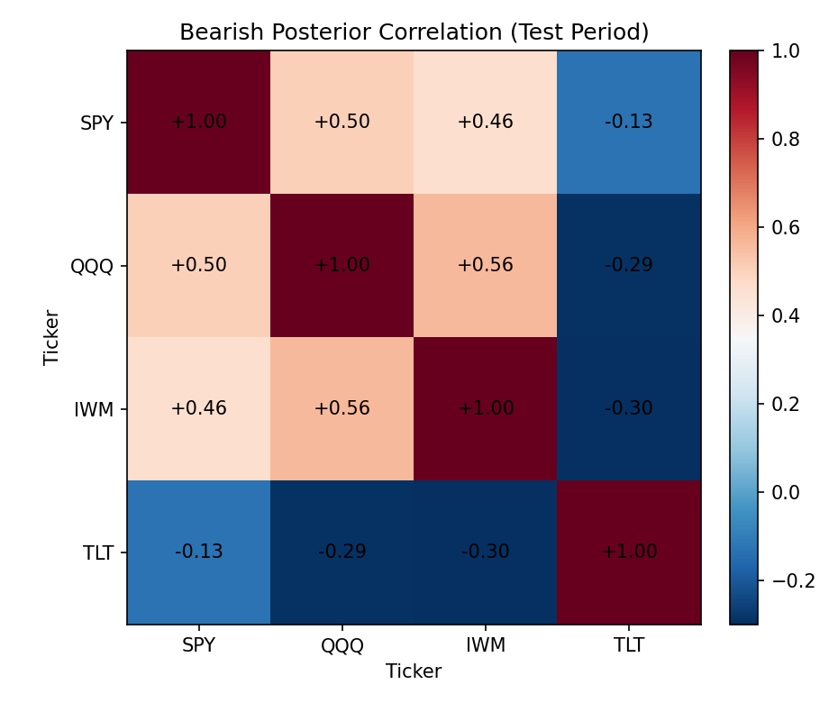

### 8. K=3 vs K=4

Since model selection (AIC/BIC) favors K=4 while we use K=3 for interpretability, this experiment directly compares both models on out-of-sample trading performance.

| Strategy | Sharpe | Ann. Return | Max Drawdown | Turnover |
|----------|--------|-------------|--------------|----------|
| K=3 weighted vote | 0.54 | 7.77% | 20.33% | 0.043 |
| K=4 weighted vote | 0.53 | 7.70% | 20.60% | 0.042 |
| K=4 sign | 0.74 | 12.15% | 23.54% | 0.096 |
| K=3 sign | 0.42 | 5.92% | 28.57% | 0.080 |
| Buy-and-hold | 0.40 | 5.57% | 27.06% | 0.000 |

For the weighted vote signal, K=3 and K=4 are virtually identical (delta Sharpe = -0.005). The K=4 sign signal does better (0.74 vs 0.42), but with higher turnover. The extra state in K=4 splits the K=3 neutral regime into two sub-states rather than adding a qualitatively new regime, justifying K=3 as the more parsimonious choice.

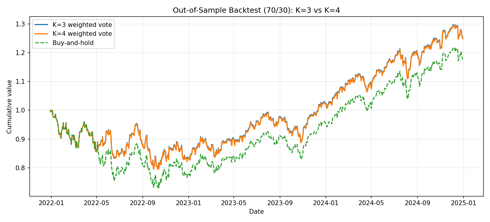

### 9. Expanding-window rolling backtest

To test robustness beyond a single 70/30 split, we use an expanding-window design: initial training on 5 years, then retrain every 6 months on all available data and test on the next 6-month window (10 windows total, 2020-2024).

| Strategy | Sharpe | Ann. Return | Max Drawdown | Turnover |
|----------|--------|-------------|--------------|----------|
| **Weighted vote** | **0.71** | **12.04%** | **24.48%** | 0.142 |
| Buy-and-hold | 0.57 | 10.23% | 36.14% | 0.000 |

The rolling Sharpe (0.71) is higher than the single-split Sharpe (0.54), and max drawdown drops from 36% (buy-and-hold) to 24.5%. The strategy outperforms in 3 out of 10 windows by annualized return (30%), but the wins are large (e.g., +68% excess in the 2022H1 drawdown, +33% during COVID) while the losses are smaller. The biggest underperformance occurs in strong bull markets (2023H1, 2023H2) where the model's caution reduces exposure during sustained rallies.

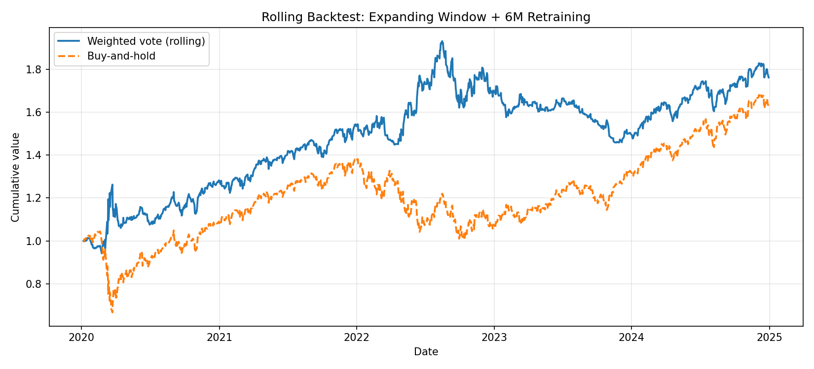
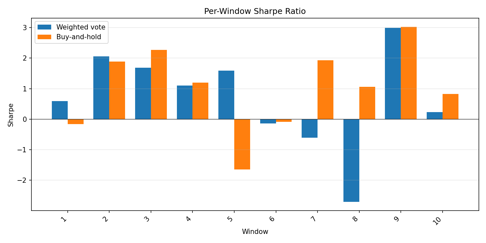

### 10. Signal refinement: no-trade zone + EMA smoothing

We post-process the weighted vote signal with two techniques: a **no-trade zone** (go flat when the neutral posterior exceeds a threshold) and **EMA smoothing** (dampen rapid signal changes). A grid search over 7 thresholds x 6 alphas identifies the best combination.

| Strategy | Sharpe | Ann. Return | Max Drawdown | Turnover |
|----------|--------|-------------|--------------|----------|
| **Best (thr=0.6, α=0.1)** | **0.71** | 4.51% | **7.80%** | 0.024 |
| Baseline (weighted vote) | 0.54 | **7.77%** | 20.33% | 0.043 |
| Buy-and-hold | 0.40 | 5.57% | 27.06% | 0.000 |

The best configuration improves Sharpe from 0.54 to **0.71** (+31%) and dramatically reduces max drawdown from 20.3% to **7.8%** (-62%). The trade-off is lower annualized return (4.5% vs 7.8%), as the model sits out more often. Neither the no-trade zone alone (Sharpe 0.28) nor EMA smoothing alone (0.43) achieves this — the combination is key.

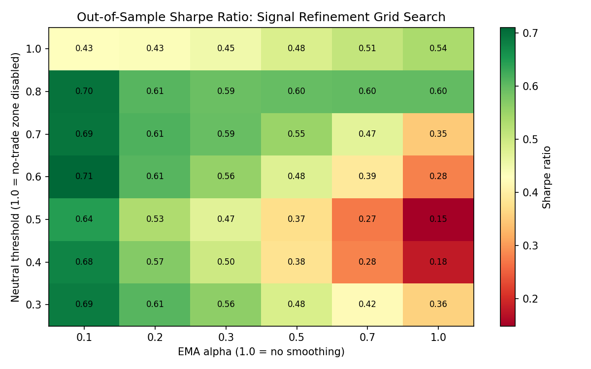
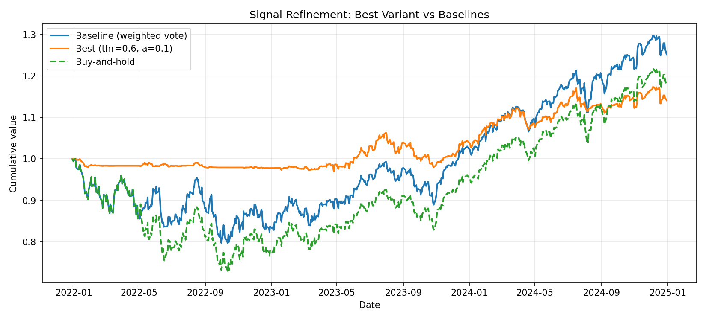

### 11. Robustness across tickers and periods

We test the full HMM pipeline on 6 configurations: 4 tickers (SPY, QQQ, IWM, EEM) on 2015-2024, plus SPY on two alternative periods (2010-2019, 2018-2024), all with 70/30 train/test splits.

| Config | Sharpe (HMM) | Sharpe (BH) | Delta | MaxDD (HMM) | MaxDD (BH) |
|--------|-------------|------------|-------|-------------|------------|
| **SPY 2015-2024** | **0.54** | 0.40 | **+0.14** | 20.3% | 27.1% |
| **QQQ 2015-2024** | **0.78** | 0.35 | **+0.43** | 23.3% | 38.5% |
| IWM 2015-2024 | -0.03 | -0.01 | -0.02 | 32.2% | 31.8% |
| **EEM 2015-2024** | -0.12 | -0.26 | **+0.14** | 23.3% | 34.8% |
| SPY 2010-2019 | 0.51 | 0.93 | -0.42 | 20.1% | 20.7% |
| SPY 2018-2024 | -0.49 | 1.38 | -1.87 | 16.2% | 10.5% |

**Win rate:** 50% by Sharpe, 67% by max drawdown reduction. The model excels on liquid large-cap equities (SPY, QQQ) and provides consistent drawdown protection. It struggles in sustained bull markets (SPY 2018-2024 test period = late 2022-2024 rally) where its caution reduces exposure during strong uptrends. IWM (small-cap) shows near-zero edge, suggesting the 3-state model fits large-cap dynamics better.

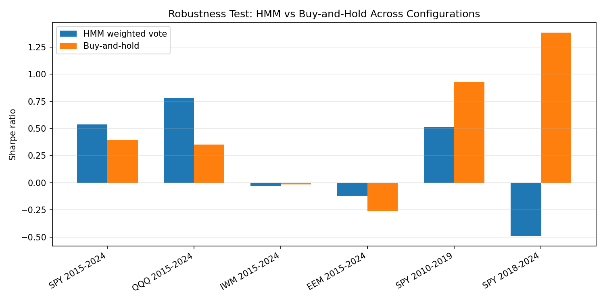
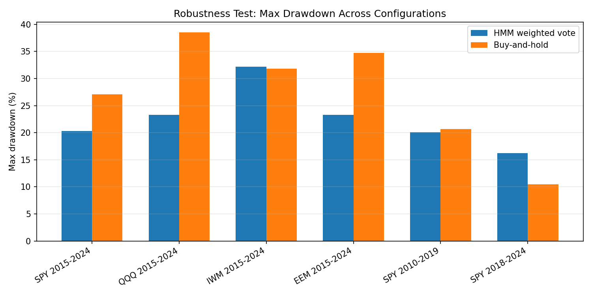

---

## Langevin / RBPF Results (SPY, 2015-2024)

### 12. Kalman filter on synthetic Langevin data

We validate the Kalman filter implementation on synthetic data from a Langevin jump-diffusion model (no jumps). The filter tracks both the log-price and the latent trend component, with residual analysis confirming correct operation.

| Metric | Value |
|--------|-------|
| Trend within 2σ band | 96.4% (target >95%) |
| Price RMSE | 0.0095 |
| Trend RMSE | 0.0136 |
| Residual mean | 0.025 (≈0) |
| Residual std | 1.02 (≈1) |
| Log-likelihood | 1187.6 |

The standardized residuals are approximately N(0,1) with 5.6% outside ±2σ (expected ~5%), confirming the filter is correctly specified.


### 13. RBPF jump detection (Paper Figure 3)

We reproduce Figure 3 from the 2012 paper: RBPF on synthetic jump-diffusion data with known jump locations. The RBPF analytically marginalizes the continuous state (price + trend) via the Kalman filter and samples only the discrete jump history.

| Metric | Value |
|--------|-------|
| True jumps | 12 |
| Detected jumps | 16 (9 TP, 1 FP) |
| Detection rate | 75.0% (target >70%) |
| False positive rate | 6.2% |
| RBPF trend RMSE | 0.0247 |
| Standard PF trend RMSE | 0.0266 |

The RBPF achieves 7% lower trend RMSE than the standard particle filter, demonstrating the Rao-Blackwell variance reduction on synthetic data where the model is correctly specified.


### 14. Standard particle filter baseline on SPY

The standard (bootstrap) particle filter serves as a baseline — it samples the full 2-D state (price + trend) with particles, unlike the RBPF which analytically marginalizes the continuous state.

| Strategy | Sharpe | Ann. Return | Max Drawdown | Turnover |
|----------|--------|-------------|--------------|----------|
| Standard PF | -1.44 | -22.89% | 56.36% | 1.3034 |
| Buy-and-Hold | 0.40 | 5.57% | 27.06% | 0.0000 |

The PF produces extremely noisy trading signals (turnover 1.30 — complete portfolio reversal every day), destroying any trend-following edge with transaction costs.


### 15. RBPF trading: jumps ON vs OFF

We compare the RBPF with jump modeling enabled vs disabled to isolate the contribution of Poisson jump detection to trading performance.

| Strategy | Sharpe | Ann. Return | Max Drawdown | Turnover |
|----------|--------|-------------|--------------|----------|
| RBPF (jumps ON) | -1.77 | -27.18% | 61.85% | 1.3656 |
| RBPF (jumps OFF) | -1.77 | -27.25% | 61.96% | 1.3617 |
| Buy-and-Hold | 0.40 | 5.57% | 27.06% | 0.0000 |

Jump modeling improves log-likelihood by +62 nats (1772 vs 1710) but has negligible impact on trading performance (+0.3% Sharpe improvement). The high turnover (~1.37) is the dominant factor, not jump detection.


### 16. HMM vs RBPF head-to-head (THE MAIN RESULT)

The definitive comparison: HMM (2020 paper) vs RBPF (2012 paper) vs standard PF vs buy-and-hold, all on the same SPY data with identical train/test split and transaction costs.

| Strategy | Sharpe | Ann. Return | Max Drawdown | Turnover |
|----------|--------|-------------|--------------|----------|
| **HMM (weighted vote)** | **0.54** | **7.77%** | **20.33%** | **0.043** |
| Buy-and-Hold | 0.40 | 5.57% | 27.06% | 0.000 |
| Standard PF | -1.66 | -25.78% | 61.47% | 1.284 |
| RBPF | -1.77 | -27.18% | 61.85% | 1.366 |

**Verdict: HMM decisively outperforms RBPF on out-of-sample SPY trading.**

Key insights:
- **RBPF achieves higher log-likelihood** (1772 vs PF's -4206), confirming the Rao-Blackwell benefit for state estimation
- **Better state estimation ≠ better trading signals** — the continuous Langevin model produces noisy trend estimates that cause excessive turnover (31.5x higher than HMM)
- **Signal correlation between HMM and RBPF ≈ 0** — the two approaches extract fundamentally different information from the same data
- The discrete regime-switching model (HMM) produces cleaner, more actionable trading signals than the continuous Langevin model (RBPF)


## References

- Christensen, H.L., Turner, R.E. & Godsill, S.J. (2020). *Hidden Markov Models Applied To Intraday Momentum Trading With Side Information*. arXiv:2006.08307.
- Christensen, H.L., Godsill, S.J. & Turner, R.E. (2012). *Bayesian Methods for Jump-Diffusion Langevin Models*. Cambridge Signal Processing Lab.
- Rabiner, L.R. (1989). *A Tutorial on Hidden Markov Models and Selected Applications in Speech Recognition*. Proceedings of the IEEE, 77(2), 257-286.
